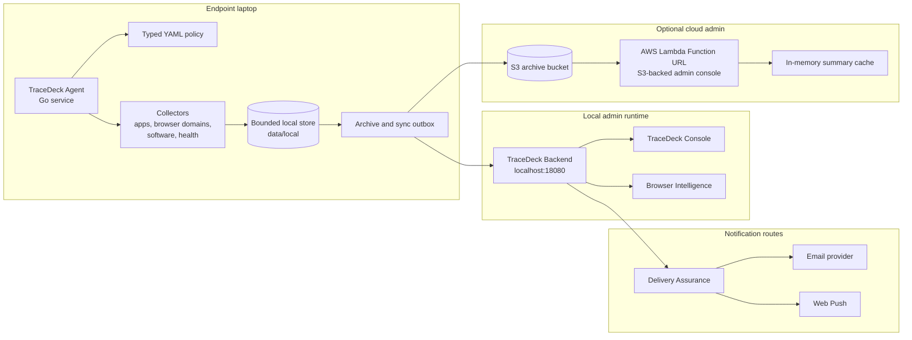

# TraceDeck

TraceDeck is a Go-based endpoint productivity and risk observability system.
It runs a lightweight local agent, stores bounded metadata locally, syncs to a
local admin backend, archives batches to S3, and exposes both a local dashboard
and an optional AWS Lambda admin console.

The project is designed for legitimate, consent-based device administration.
It is not a credential capture tool, keylogger, or covert screen recorder.

## What It Does

- Collects endpoint metadata such as process snapshots, foreground app signals,
  device health, software inventory changes, and browser domain/category
  activity.
- Classifies study, coding, entertainment, risky software, and policy signals.
- Stores local data under `data/local/` and logs under `logs/local/`.
- Syncs metadata to the local backend at `http://127.0.0.1:18080`.
- Uploads archive batches to S3 when live archive is enabled.
- Shows admin views for command center, host portfolio, browser intelligence,
  delivery assurance, trust, and cloud archive proof.
- Supports Windows now, with macOS and Linux service manifests and platform
  adapters in the repo.

## Architecture



The same diagram is also stored at
[`docs/diagrams/tracedeck-architecture.mmd`](docs/diagrams/tracedeck-architecture.mmd).

## Quick Start

Prerequisites:

- Go
- Python 3
- PowerShell
- AWS CLI and SAM CLI only for cloud deployment

Start or check the local backend:

```powershell
python ./devctl.py server task-start
python ./devctl.py server task-status
python ./devctl.py doctor --skip-cloud
```

Open the local admin console:

```text
http://127.0.0.1:18080/
```

Useful local routes:

- `/` - modern TraceDeck Console
- `/browser-activity` - Chrome, Edge, and Brave browser activity viewer
- `/v1-old` - preserved legacy dashboard fallback
- `/health` - backend health

Repair or install silent Windows autostart for this machine:

```powershell
powershell -NoProfile -ExecutionPolicy Bypass -File ./scripts/local/repair-live-agent-autostart.ps1 -SkipBuild
```

Verify local agent, backend, S3 archive, and cloud Lambda:

```powershell
powershell -NoProfile -ExecutionPolicy Bypass -File ./scripts/local/test-agent-live-health.ps1
powershell -NoProfile -ExecutionPolicy Bypass -File ./scripts/local/check-live-s3-metrics.ps1
powershell -NoProfile -ExecutionPolicy Bypass -File ./scripts/local/test-runtime-doctor.ps1 -IncludeCloud
```

## Cloud Admin

TraceDeck includes a SAM app under `sam-app/`. It deploys a public Lambda
Function URL without API Gateway. The Lambda frontend reads S3 archive objects
as source of truth and shows cache hit/miss metrics to reduce S3 calls.

```powershell
python ./devctl.py sam build
python ./devctl.py sam deploy
python ./devctl.py sam outputs
python ./devctl.py doctor
```

Deployment outputs are saved under `data/local/output/`, including
`stack-outputs.txt` and `frontend-url.txt`.

## Repository Map

| Path | Purpose |
| --- | --- |
| `agent/` | Go endpoint agent, collectors, policy loading, local storage, archive, alerts |
| `backend/` | Go local backend API and embedded admin UI |
| `browser-extension/` | Chromium extension bridge skeleton for browser metadata |
| `deployments/` | Windows Task Scheduler, macOS launchd, Linux systemd, OTel manifests |
| `docs/` | Reader-facing docs and architecture diagrams |
| `examples/` | Sample typed policies |
| `postman/` | Postman/Newman API collections |
| `sam-app/` | AWS SAM Lambda admin frontend |
| `scripts/` | Repeatable local, verification, deployment, and service scripts |
| `data/` | Local generated runtime data, ignored by git |
| `logs/` | Local generated logs, ignored by git |

## Documentation

Start here:

- [Documentation Index](docs/README.md)
- [Quick Start](docs/quickstart.md)
- [Architecture](docs/architecture.md)
- [Operations](docs/operations.md)
- [Testing](docs/testing.md)
- [Privacy](docs/privacy.md)
- [Cloud Frontend](docs/cloud-frontend.md)

Old phase-heavy notes were moved to
`docs/reference/legacy-phase-notes/` so the main docs stay readable.

## Verification

Fast local checks:

```powershell
python ./devctl.py doctor --skip-cloud
powershell -NoProfile -ExecutionPolicy Bypass -File ./scripts/verify/check-root-clean.ps1
```

Cloud-inclusive check:

```powershell
powershell -NoProfile -ExecutionPolicy Bypass -File ./scripts/local/test-runtime-doctor.ps1 -IncludeCloud
```

Quality gate:

```powershell
python ./devctl.py test quality
```

## Privacy Boundary

TraceDeck is metadata-first. The default project boundary denies passwords,
keystrokes, cookies, tokens, private messages, raw page content, raw URLs, page
titles, camera, microphone, and covert collection. Browser evidence is
domain/category based. Demo seed rows are hidden from live views unless an
explicit demo flag is used.

See [Privacy](docs/privacy.md) and [Collection Policy](docs/collection-policy.md)
for the exact policy model.
