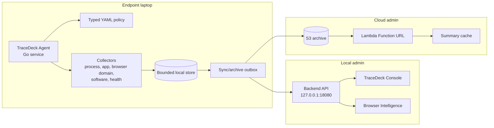

# Architecture

TraceDeck has four runtime pieces:

1. Endpoint agent
2. Local backend and console
3. S3 archive
4. Optional Lambda admin frontend



## Endpoint Agent

The agent is written in Go. It loads a typed YAML policy, runs collectors, writes
bounded local data, syncs metadata to the local backend, and archives batches to
S3 when live archive is enabled.

Main paths:

- `agent/cmd/tracedeck-agent`
- `agent/internal/config`
- `agent/internal/collector`
- `agent/internal/archive`
- `agent/internal/alert`

## Local Backend

The backend is also Go. It serves the local API and embedded admin pages.

Main paths:

- `backend/cmd/tracedeck-backend`
- `backend/internal/api`
- `backend/internal/store`
- `backend/internal/api/web`

## Cloud Frontend

The SAM app under `sam-app/` deploys a Lambda Function URL. It reads S3 archive
metadata, samples safe rows, and shows cache hit/miss metrics.

## Data Flow

```text
collector -> local store -> local backend -> dashboard
collector -> local store -> archive outbox -> S3 -> Lambda dashboard
policy/risk rules -> delivery assurance -> email/web push routes
```

## Privacy Model

TraceDeck is metadata-first. The architecture is built around typed allow/deny
capabilities, bounded storage, source-kind labels, and demo/live separation.
